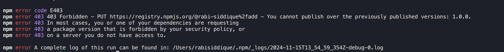
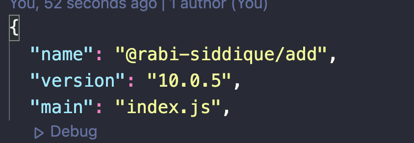
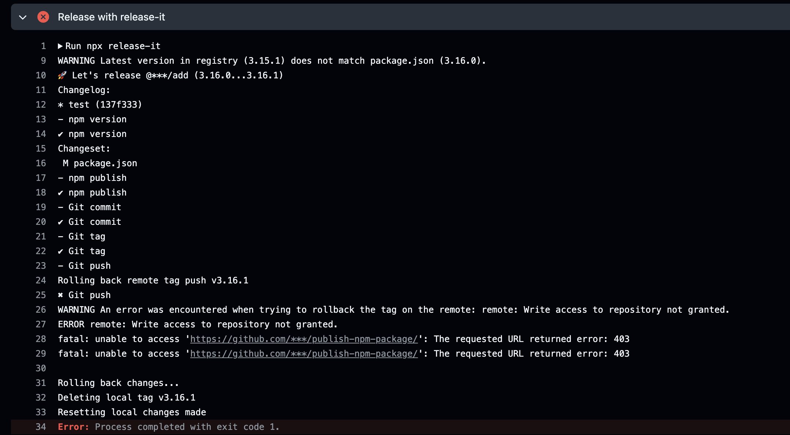

# Publishing the package manually

## 1. Log in to npm

Before you publish, ensure that you are logged in to npm with the account that owns the `@rabi-siddique` scope:

```bash
npm login
```

Follow the prompts to enter your username, password etc.

## 2. Publish Your Package

Once you are logged in and your `package.json` is correctly set up, try publishing the package with public access:

```bash
npm publish --access public
```

This command explicitly sets the package to be public, allowing anyone to install it without facing access restrictions.

## 3. Releasing a new version

Attempting to publish the package without updating the version number in package.json will result in the following error:


As the error message says:
**You cannot publish over the previously published version**

To successfully publish, increment the version number in `package.json` to a new value that differs from the previous release. This change ensures that npm recognizes it as a new version, allowing the publication to proceed without errors.

You have the flexibility to choose any version number when publishing your package. For example, if your initial release was version `1.0.1`, you could choose to update it to `10.0.5` for a subsequent release:


npm allows version downgrades. You can publish a lower version, such as `3.0.5`, even after releasing a higher version like `10.0.5`, and it will still be processed successfully.

# Release It

`release-it` is a versatile tool for automating version management and package publishing workflows. It handles the version bumping, tagging, and publishing of your software projects.

## 1. Install release-it

First, you need to add `release-it` to your project.

```bash
npm install --save-dev release-it
```

## 2. Configuration

`release-it` can be configured in various ways, such as through the `package.json` file, a `.release-it.json` configuration file, or `CLI arguments`. Here's an example of basic configuration in your `package.json`:

```bash
"release-it": {
  "git": {
    "commitMessage": "Release v${version}",
    "tagName": "v${version}",
    "tagAnnotation": "Release v${version}",
    "push": true
  },
  "npm": {
    "publish": true
  },
  "hooks": {
    "after:bump": "npm run build"
  }
}
```

This configuration does the following:

- `commitMessage`: This defines the commit message format when the version bump is committed. The placeholder `${version}` dynamically inserts the new version number (e.g., Release v1.2.3).

- `tagName`: Specifies the format of the Git tag created for the release. For example, a tag named `v1.2.3` will be created for version `1.2.3`.

- `tagAnnotation`: Provides an annotation or description for the tag. This annotation is useful for documenting the purpose or context of the tag.

- `push: true`: If true, release-it will automatically push the version bump commit and tag to the remote Git repository.

- `npm`: The "npm" section specifies how release-it interacts with the npm registry.

- `"publish": true`: If true, release-it will publish the new version of your package to the npm registry after bumping the version.

- `hooks`: A section in the configuration file that specifies commands to be run at certain points during the versioning process.

- `after:bump`: A hook that runs after the version number is bumped in your project. For example, if the version changes from 1.0.0 to 1.1.0, this hook is triggered immediately afterward.

- `npm run build`: The command executed by the `after:bump` hook. In this case, it runs the build script defined in your project's package.json.

# Errors

I encountered this error in CI while attempting to make a commit:


Initially, I suspected that my token lacked push access. This [Stack Overflow](https://stackoverflow.com/questions/70538793/remote-write-access-to-repository-not-granted-fatal-unable-to-access) thread provided a solution.
